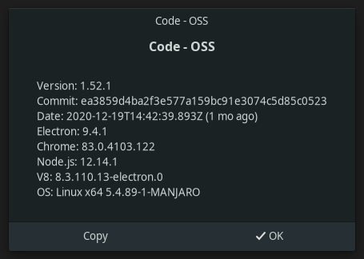

## Preparation

1. `$ cd` into the root of this repository
1. Run `$ code --user-data-dir data/user --extensions-dir data/exts .`
1. This will open a fresh instance of Visual Studio Code distinct from your personal installation
1. Notice the notification that says `Do you want to install the recommended extensions for this repository?`
1. Click on `Install` to install the `LaTeX Workshop` extension
1. Wait until the installation is finished


## Configuration

Open [`.vscode/settings.json`](.vscode/settings.json) and replace the following string in the JSON key `latex-workshop.latex.outDir` with the absolute path to the folder this repository lives in on your file system:

```
/home/jonas/git/vonas/LaTeX-Workshop-issue-nope
```

You can get that path by entering the command `$ pwd` in the terminal with which you launched Visual Studio Code, assuming you haven't changed the directory afterwards.

It's also fine to enter any other directory name that exists, but leaving things grouped in the directory of this repository will keep things organized.

Afterwards the path should look something like this:

```
/path/to/LaTeX-Workshop-issue-nope/build/%DIR%
```


## Reproduction

1. Open [`super.tex`](super.tex) in the editor and press `CTRL+S`
1. This should trigger a successful build
1. Now open [`sections/sub.tex`](sections/sub.tex) and press `CTRL+S` again
1. This too triggers the LaTeX build
1. Unlike the previous build, this one will fail with an error
1. Click on `Open compiler log` to see your compilation results

This is an excerpt of what you should see:

```
! LaTeX Error: File `../super.tex' not found.
```


## Cause

What triggers this error is the following configuration in [`.vscode/settings.json`](.vscode/settings.json):

```json
{
    "latex-workshop.latex.outDir": "/repo/build/%DIR%"
}
```

`/repo` here is the path you entered previously.


## Attempt at a workaround

Make the following change in [`sections/sub.tex`](sections/sub.tex):

```diff
-\documentclass[../super.tex]{subfiles}
+\documentclass[super.tex]{subfiles}
```

Hit `CTRL+S` and it should work just fine.

Unfortunately, when you change [`super.tex`](super.tex), then save it and afterwards change [`sections/sub.tex`](sections/sub.tex) again and save it, you will git the same error again, saying `super.tex` i.e. `sections/super.tex` does not exist.


## Actual workaround

Change `latex-workshop.latex.outDir` in [`.vscode/settings.json`](.vscode/settings.json) to a relative path, like `%DIR%/build`, and everything works like a charm.

---

## Environment


### LaTeX logs

Find the logs of my extension's compilation results in the [`build-personal`](build-personal) folder.


### Visual Studio Code


